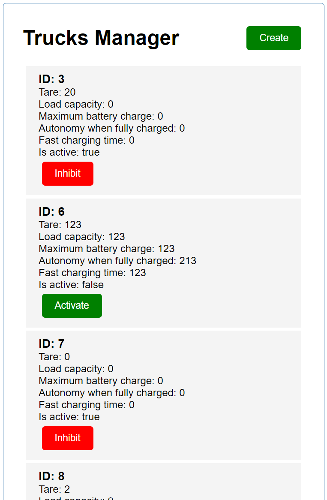

# Trucks_Website
Technologies: JS, TS, Angular, HTML, CSS

This is a website for an imaginary delivery company. It allows to monitor the fleet of the trucks owned by the company: 

And add new trucks to the fleet and change the activity status of the already existing trucks: 

The website uses an external API to connect to the database. You can find the code of the used API on my repository: https://github.com/DanyKrk/Trucks_API .

How to use:
1. Clone the repository.
2. Specify the URL of the used API in the src/app/interfaces/constatns.ts file.
3. While being in the Trucks_Website folder run the "ng serve" command.

The website should run after you complete the steps. To view the website you should enter the URL specified in the response to the "ng serve" command (usually http://localhost:4200/).